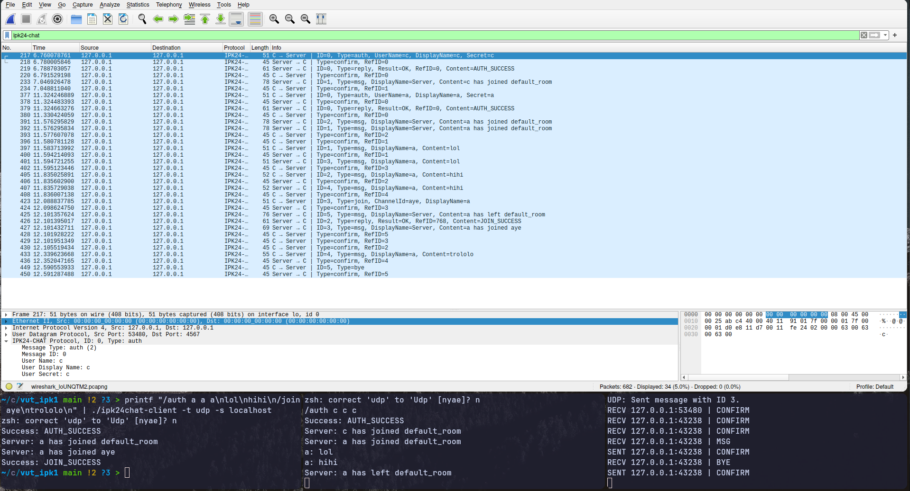
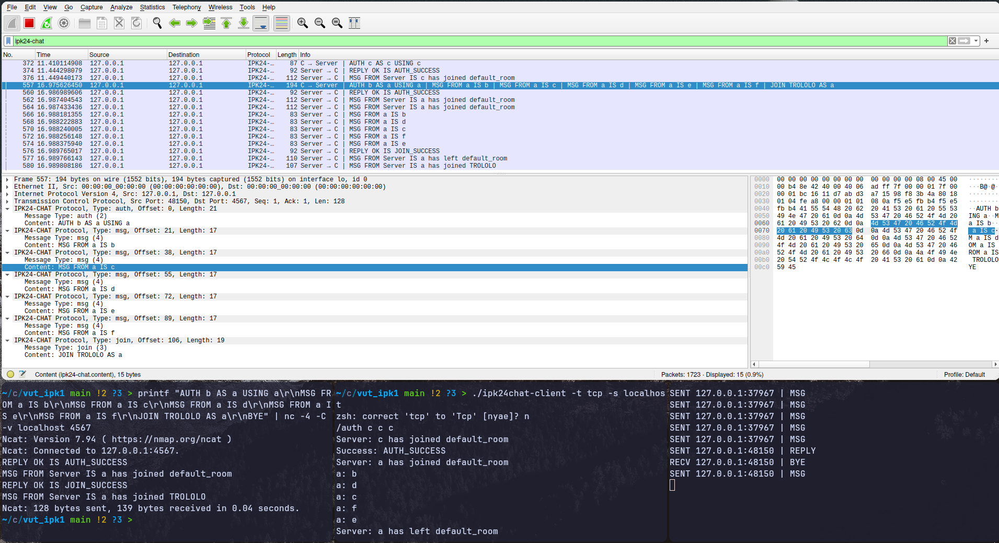
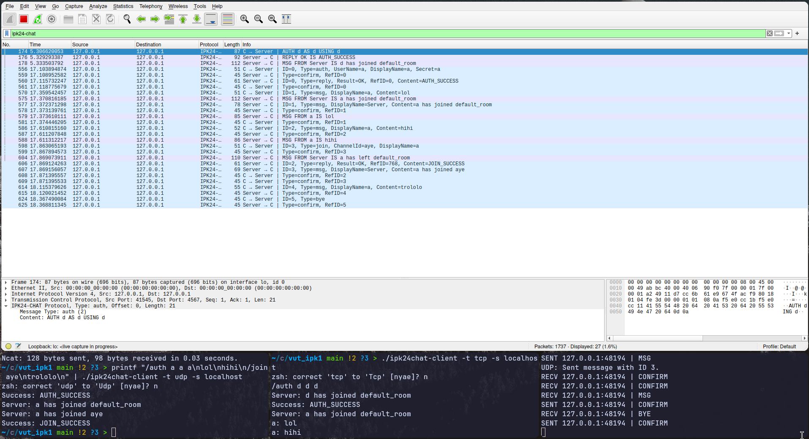

# IPK Project 2: Chat server using IPK24-CHAT protocol
Author: Mykola Vorontsov (xvoron03)  
License: AGPL-3.0

## Theory summary
This is an implementation of a server for the `IPK24-CHAT` protocol as specified by its [specification](https://git.fit.vutbr.cz/NESFIT/IPK-Projects-2024/src/branch/master/Project%202/iota) in [Project2].  
C# programming language and .NET 8 is used to implement this project.
For parallel processing, the asynchronous programming model is used, using C#'s `async` and `await` [AsyncProgramming].  
The core idea for the server and both (TCP and UDP) protocols is to have a main listener Task that executes indefinitely and accepts incoming connections and then creates a new Task for each connection with a client.

## Project structure
### Class diagram

## UDP protocol demonstration

## TCP protocol demonstration

## Testing
### UDP

Testing of UDP part was done using Wireshark and my IPK24-CHAT clients. 
On the screenshot you can see the communication between two clients and the server.

### TCP

Testing of TCP part was done using Wireshark, Netcat and my IPK24-CHAT clients.
On the screenshot you can see the communication between server, client in the same room and mock client using Netcat, 
who sends one big message, which server successfully splits into multiple messages.

### Cross-protocol testing

Testing of Cross-protocol part was done using Wireshark and my IPK24-CHAT clients.
On the screenshot you can see the communication between server, client in the same room connected by TCP and client
connected by UDP with pre-made messages.

## Extra functionality
CTRL+C signal handling: when the server receives a `SIGINT` signal, it properly closes all connections with `BYE` message and exits the application freeing all resources. 

## Bibliography
[Project1] Dolejška, D. _Client for a chat server using IPK24-CHAT protocol_ [online]. February 2024. [cited 2024-04-22]. Available at: https://git.fit.vutbr.cz/NESFIT/IPK-Projects-2024/src/branch/master/Project%201  
[Project2] Dolejška, D. _Chat server using IPK24-CHAT protocol_ [online]. April 2024. [cited 2024-04-22]. Available at: https://git.fit.vutbr.cz/NESFIT/IPK-Projects-2024/src/branch/master/Project%202/iota  
[AsyncProgramming] Microsoft. _Asynchronous programming with async and await_ [online]. [cited 2024-04-22]. Available at: https://learn.microsoft.com/en-us/dotnet/csharp/asynchronous-programming/
[RFC9293] Eddy, W. _Transmission Control Protocol (TCP)_ [online]. August 2022. [cited 2024-02-14]. DOI: 10.17487/RFC9293. Available at: https://datatracker.ietf.org/doc/html/rfc9293  
[RFC768] Postel, J. _User Datagram Protocol_ [online]. March 1997. [cited 2024-02-14]. DOI: 10.17487/RFC0768. Available at: https://datatracker.ietf.org/doc/html/rfc768  